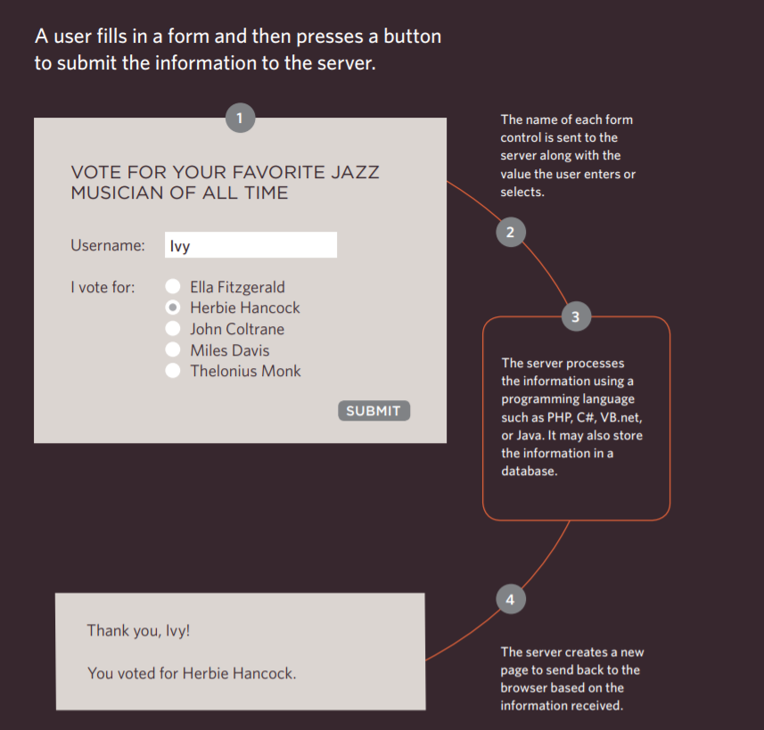

# Forms 
**types**
* Adding text (text , password and text area inputs)
* Choice making (radio button,checklist and dropdown)
* sumbitting (submitt button or image )
* uploading files
**How it works**

`<form>` tag is used to contain the form content and we use `<input>` tag  and give it different types and methods in order to get differnt  types of forms also the tags `<select>`and `<option`> are used to make differnt types of lists ,submissions are types of `<input>`controls in addition to the tag `<button>`.
**Validation of Forms**
 form validation has been performed using JavaScript,mainly it's an alert that teels user that there ia a mistake in the input that provided, But HTML5 is introducing validation and leaving the work to the browse
 **CSS**
 to give a new apperance to your ol or ul lists just add the `list style` properties to define the type and position and even add an image to the list's pollits ,related to tables Table cells also can have different borders and spacing in different browsers, but there are properties you can use to control them and make them more consistent for example you can control empty cells by targeting those then add a property from hide or show or inherit to make the cell obays the rules of table containing ,you can  control the cells background colors and width and borders.
 forms haping is more complicated because one tag has two many properties  and targeting the  process that during  it the user is making actions such as input or select or upload.