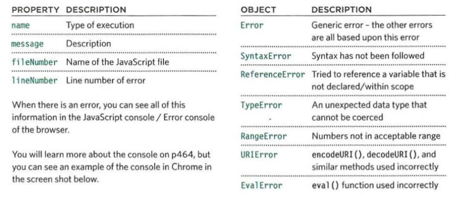
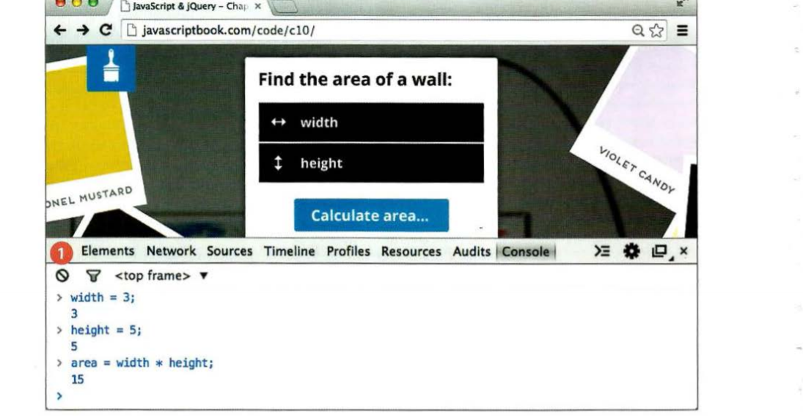

# Debuging code:
Java Script excuting code line by line ,so when a statement needs data from upcoming line the code will stuck till the lines befor performed functions.each time new item is added to the code it creats a new ecuting content.this make the tasks stacking up on each other.
**EXECUTION CONTEXT & HOISTING**
 there are two phases of activity: 
 4. PREPARE,create new scope,functions,varibles,arguments and determines keywords.
 2. EXECUTE ,assigne values to variables,referance functions and ecute statements.
 **UNDERSTANDING SCOPE**
 In the interpreter, each execution context has its own va ri ables object. It holds the variables, functions, and parameters available within it. Each execution context can also access its parent's v a ri ables object. 
 **Errors**
 If a JavaScript statement generates an error, then it throws an exception.At that point, the interpreter stops and looks for exception-handl ing code. If you are anticipating that something in your code may cause an error, you can use a set of statements to `handle` the error,whenever the interpreter comes across an error, it will look for error-handling code.Error objects can help you find where your mistakes are and browsers have tools to help you read them. 
 
 So wheneveryou find error in your script you can either debugging the script or handle errors gracefully.
 **Debugg:**
 Debugging is about deduction: eliminating potential causes of an error,Try to narrow down where the problem might be, then look for clues.The JavaScript console will tell you when there is a problem with a script, where to look for the problem, and what kind of issue it seems to be. The JavaScript console is just one of several developer tools that are found in all modern browsers. The console will show you when there is an error in your JavaScript. It also displays the line where it became a problem for the interpreter.
You can also just type code into the console and it will show you a result.

**BREAKPOINTS**
You can pause the execution of a script on any line using breakpoints. Then you can check the values stored in variables at that point in time. If you set multiple breakpoints, you can step through them one-by-one to see where values change and a problem might occur.  You can indicate that a breakpoint should be triggered only if a condition that you specify is met. The condition can use existing variable
**HANDLING EXCEPTIONS**
If you know your code might fail, use try, catch, and finally. Each one is given its own code block.
1. try :First, you specify the code that you think might throw an exception within the try block.
2. Catch :If the try code block throws an exception, catch steps in with an alternative set of code. 
3. FI NALLY :The contents of the fi na 11 y code block will run either way - whether the try block succeeded or failed. 