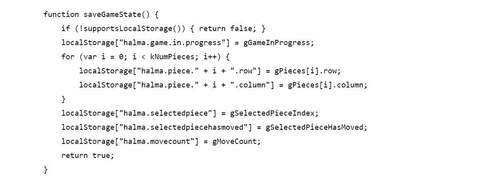

# Past,FutureadPresent of local storage:
 For native applications, the operating system typically provides an abstraction layer for storing and retrieving application-specific data like preferences or runtime state. values stored in the registry, INI files, XML files, or other place according to platform.Also in local store you can embed your own database, invent your own file format, or any number of other solutions.
 Back to the history of web applications, Cookies were invented early in the web’s history, and indeed they can be used for persistent local storage of small amounts of data. But they have three downsides:
 * are included with every HTTP request, thereby slowing down your web application.
 * ending data unencrypted over the internet.
 * imited to about 4 KB of data so slow down your application with no back benefit.
 # History:
 In the beginning, there was only Internet Explorer.Microsoft invented a great many things and included them in their browser-to-end-all-browser-wars, Internet Explorer. One of these things was called DHTML Behaviors, and one of these behaviors was called userData.In 2002, Adobe introduced a feature in Flash 6 that gained the unfortunate and misleading name of “Flash cookies.”now know as  Local Shared Objects.allows Flash objects to store up to 100 KB of data per domain.
 In 2007, Google launched Gears, an open source browser plugin aimed at providing additional capabilities in browsers.Gears provides an API to an embedded SQL database based on SQLite. After obtaining permission from the user once, Gears can store unlimited amounts of data per domain in SQL database tables.
 # HTML5:
  A way for web pages to store named key/value pairs locally, within the client web browser. Like cookies, this data persists even after you navigate away from the web site, close your browser tab, exit your browser, or what have you. Unlike cookies, this data is never transmitted to the remote web server.

 `(Modernizr.localstorage) {`
 ` // window.localStorage is available!`
`} else {`
`  // no native support for HTML5 storage :(`
 ` // maybe try dojox.storage or a third-party solution`
`}`
# Using HTML5 Storage:
HTML5 Storage is based on named key/value pairs. You store data based on a named key, then you can retrieve that data with the same key. The named key is a string. The data can be any type supported by JavaScript, including strings, Booleans, integers, or floats. However, the data is actually stored as a string. If you are storing and retrieving anything other than strings, you will need to use functions like parseInt() or parseFloat() to coerce your retrieved data into the expected JavaScript datatype.

Calling `setItem()` with a named key that already exists will silently overwrite the previous value. Calling `getItem()` with a non-existent key will return null rather than throw an exception.
`var foo = localStorage.getItem("bar");`
`// ...`
`localStorage.setItem("bar", foo);`
…could be rewritten to use square bracket syntax instead:

`var foo = localStorage["bar"];`
`// ...`
`localStorage["bar"] = foo;`
# Changes on HTML5 :
The storage event is supported everywhere the localStorage object is supported, which includes Internet Explorer 8. IE 8 does not support the W3C standard `addEventListener`.
`if (window.addEventListener) {`
 `window.addEventListener("storage", handle_storage, false);`
`} else {`
  `window.attachEvent("onstorage", handle_storage);`
`};`
The handle_storage callback function will be called with a StorageEvent object, except in Internet Explorer where the event object is stored in window.event.

`function handle_storage(e) {`
  `if (!e) { e = window.event; }`
`}`

# HTML5 STORAGE IN ACTION:
 If your browser supports HTML5 Storage, the demonstration page should magically remember your exact position within the game, including the number of moves you’ve made, the position of each of the pieces on the board, and even whether a particular piece is selected.
 
 It uses the localStorage object to save whether there is a game in progress.Using HTML5 Storage, the `resumeGame()` function checks whether a state about a game-in-progress is stored locally. If so, it restores those values using the localStorage object,most important part of this function is data is stored as strings. If you are storing something other than a string, you’ll need to coerce it yourself when you retrieve.

 